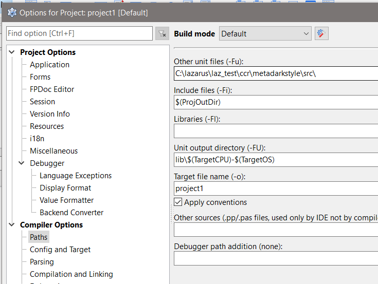

# laz_dark_themes

The project is testing dark theme support packages (Windows only!).

The source code of the packages is here: https://github.com/zamtmn/metadarkstyle
Wiki: https://deepwiki.com/zamtmn/metadarkstyle

To build an application with support for the Windows dark theme, specify the path to the package source directory in the project options (Lazarus IDE "Project Options" --> "Compiler Options" --> "Paths" --> edit field "Other unit files(-Fu)") 

and add support for the dark theme to the project file before initializing the application.

**Note**: *to build applications with support for the Windows dark theme, it is not necessary to install the design packages of the IDE itself.*